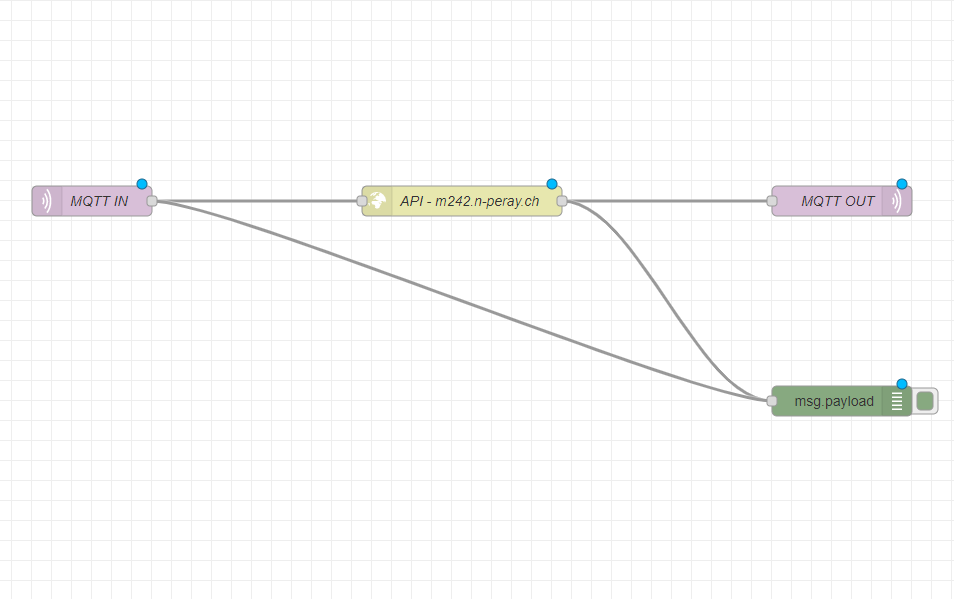

# m242 LB3

## Projekt

Für die LB2 des Moduls haben wir ein kleines Tool zur Zeiterfassung erstellt [(github/m242)](https://github.com/NathanPeray/m242). Für LB3 sollte der Datentransfer mittels MQTT funktionieren.

## Komponenten

Weitere Informationen zu den Komponenten sind in der Beshreibung von LB2 vorhanden: [github/m242](https://github.com/NathanPeray/m242).
## MQTT

MQTT steht für Message Queuing Telemetry Transport und ist ein Netzwerkprotokoll. Das Protokoll läuft standardmässig auf TCP/IP und benutzt den port 1883. Ein MQTT Netzwerk besteht aus verschienden Clients und mindestens einem Broker, wobei ein Client auch ein Broker sein kann.

Der Datentransfer wird über sogenannte "Topics" realisiert. Ein client kann Daten an den Broker senden. Diese Datenwerden einem Topic zugewiesen. Andere Clients können diese Topics "abonieren", und so die Gesendeten Daten lesen.

Der Broker sorgt dafür das die veröffentlichten Daten, allen Clients mitgeteilt werden.

---
## Vorgehen

### Azure Cloud VM
Als haben wir einen MQTT Broker eingerichtet. Wobei es nicht bei einem blieb. Als erstes haben wir versucht einen Broker auf einer Azure VM einzurichten. Das vorgehen mussten wir schnell wieder unterbrechen, da der PORT 1883 nicht geöffnet werden konnte und uns zu diesem Zeitpunkt nicht bewusst war, dass wir den Port einfach ändern können.

### Raspberry PI
Als nächstes haben wir den Raspberry PI aus dem winterschlaf geholt, und eine Debian Version installiert. Danach haben wir den Mosquitto broker installiert. Vermutlich war die Firewall des Routers nicht einverstanden, also wurde auch diese Variante über den Haufen geworfen.

### Mosquitto auf Windows
Schlussendlich haben wir den Mosquitto Broker für windows installiert. Kann [hier](https://mosquitto.org/download/) heruntergeladen werden. Danach wurde mosquitto installiert.


### node-red
Nach der Installation, wurde noch node-red installiert. Dazu muss man lediglich [nodejs](https://nodejs.org/en/) installiert haben. Ist nodejs installiert, kann man in der Konsole die folgende Zeile eingeben, und node-red wird installiert.

```
npm install -g --unsafe-perm node-red
```

Damit Wir den Webserver weiterhin verwenden können musste die MQTT anfrage konvertiert werden. Unser Webserver versteht kein MQTT. Dazu haben wir in Node red folgenden Flow implementiert.



### IotKit

Natürlich musste auch das Programm für unser IotKit angepasst werden. Das komplette Programm ist im Repository zu finden. Die wichtigste änderung wurde wie folgt vorgenommen:

```cpp
bool storeData(char url[]) {

    HttpRequest* request = new HttpRequest(wifi, HTTP_GET, url);
    HttpResponse* result = request->send();

    if(result) {
        oled.clear();
        oled.cursor( 1, 0 );   
        MbedJSONValue parser;
        parse(parser, result->get_body_as_string().c_str());
        std::string answer;
        answer = parser["message"].get<std::string>();
        oled.printf("%s", answer.c_str());
        delete result;
        return true;
    } else {
        printf("Result fucked up \n");
        return false;
    }
}
```

Die "alte" storeDate funktion wurde komplett entfernt. Dafür kam eine nue hinzu, mit der die MQTT nachrichten versendet werden können:

```cpp
void publish( MQTTNetwork &mqttNetwork, MQTT::Client<MQTTNetwork, Countdown> &client, char* topic )
{
    MQTT::Message message;    
    oled.cursor( 2, 0 );
    oled.printf( "Topi: %s\n", topic );
    oled.cursor( 3, 0 );    
    oled.printf( "Push: %s\n", buf );
    message.qos = MQTT::QOS0;
    message.retained = false;
    message.dup = false;
    message.payload = (void*) buf;
    message.payloadlen = strlen(buf)+1;
    client.publish( topic, message);  
}
```
Die verbindung mit dem MQTT Broker wurde in der ```main``` Funktion aufgebaut:

```cpp
MQTTNetwork mqttNetwork( wifi );
MQTT::Client<MQTTNetwork, Countdown> client(mqttNetwork);
```

Dazu wird wieder ein WifiInterface benötigt. Als letztes wurde noch die Nachricht versendet wenn eine Karte an den Reader gehalten wurde:

```cpp
sprintf( buf, "%02X:%02X:%02X:%02X:", rfidReader.uid.uidByte[0], rfidReader.uid.uidByte[1], rfidReader.uid.uidByte[2], rfidReader.uid.uidByte[3] );
publish( mqttNetwork, client, topicRFID );    
```

---

## Reflexion

Nach dem die LB2 ohne grössere Probleme realsiert werden konnte. Hat das Programm nach den Änderungen nicht mehr funktioniert. Wobei das Programm funktioniert und auch die Karte erkennt und deren uid auf der Konsole ausgiebt. Die Nachricht ist allerdings nie auf dem Server angekommen. Um den Broker abzuhören haben wir in der Konsole folgenden befehle eingegeben:

```
mosquitto_sub -h "localhost:1883" -t "iotkit/rfid"
```

Nachrichten wurden allerdings keine empfangen. Nach einer langen Fehler suche wurde das unterfangen aufgegeben. Allerdings haben wir vor der totalen Kapitulation noch versucht die Daten an einen anderen Broker zu senden. Dazu haben wir zwei verschieden Broker ausprobiert, einemal ```cloud.tbz.ch``` und einmal ```broker.mqttdashboard.com```. beide wurden mittels ```mosquitto_sub``` abgehört, allerdings kam auch dort keine Nachricht an. Da auch auf dem IoTKit keine Fehler gemeldet wurden, gehen wir davon aus, dass die NSA unsere Nachrichten abgefangen hat.

Vermutlich liegt das Problem am MQTT Protokoll. Genauer gesagt wie die Daten übertragen werden. Nachrichten werden gesendet allerdings gibt es keine Fehlermeldungen wie ```404 Page not found```. Die Nachrichten werden also einfach ins leere gesendet und wir haben keine Ahnung wohin. Bis zum Datentransfer scheint alles zu funktionieren. Da wir noch nie von Netzwerktechnologien begeistert waren, haben wir entschieden es dabei zu belassen und das Projekt so abzugeben. 
